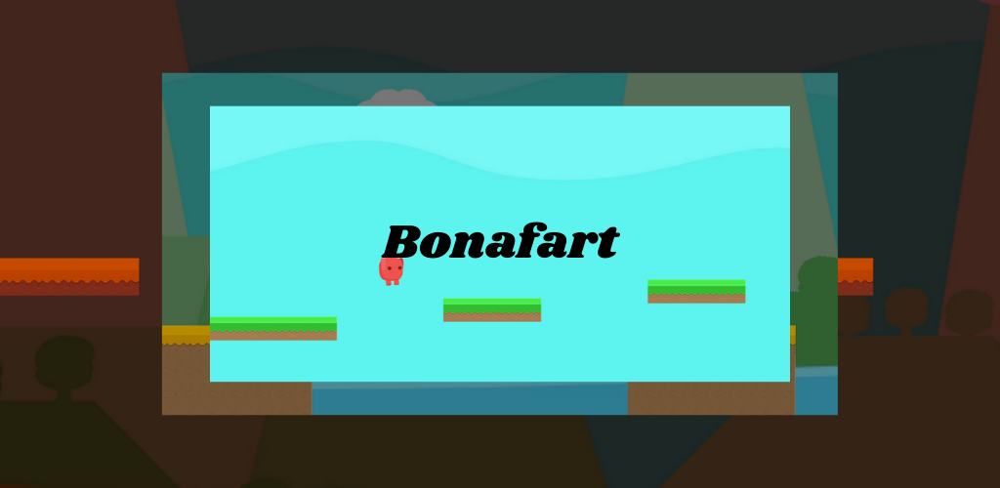
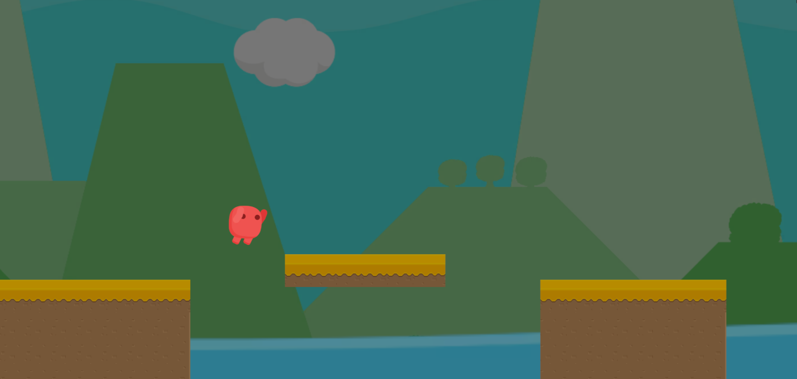
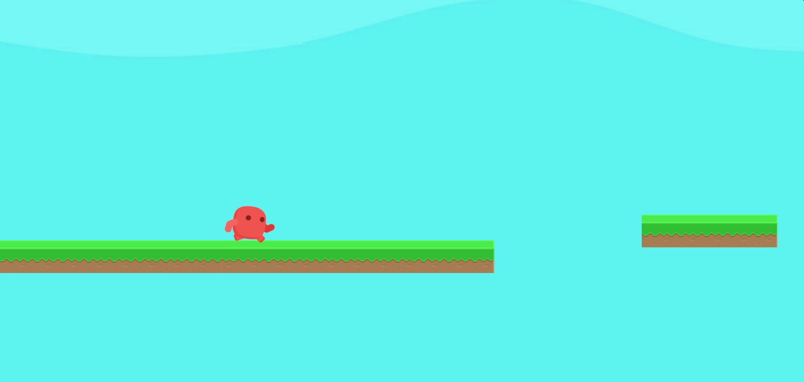
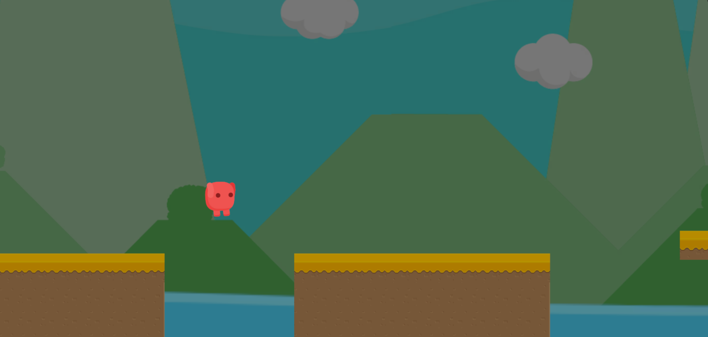
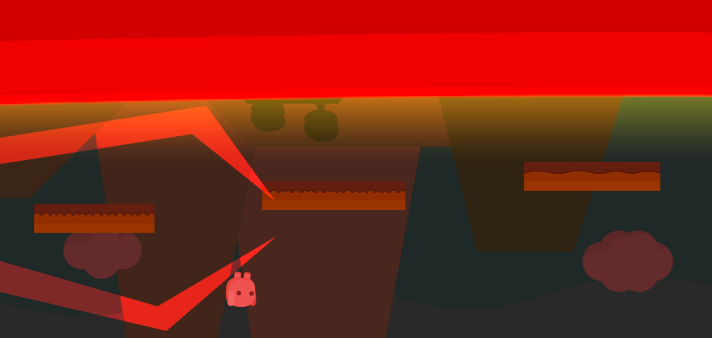
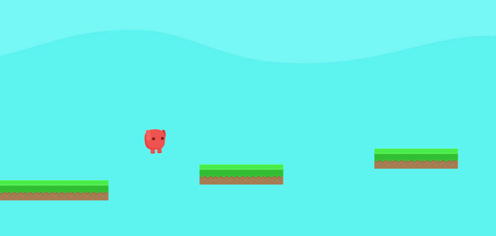

# Bonafart

Bonafart isimli oyun mobil anlamda denediğim ilk oyundur. Unity oyun motoru kullanılarak oluşturulan bu oyun, basit mekanikleri olan bir platform oyunudur. 

 
Şu anda Google Play Store üzerinden oynanabilmektedir.

 

 
Oyunun epik bir hikayesi bulunmaktadır. Oyunun hikayesi ve oynanışını izlemek isterseniz aşağıdaki bağantıya tıklayarak YouTube platformu üzerinden yayınlanmış olan teaser videosunu izleyebilirsiniz.

 
  
 <h2>Oyunun Katkıları</h2>
 
Oyun bana kendimi geliştirmem adına çok şey katmıştır. Özellikle tüm süreçle bizzat kendim ilgilenmem oyunun her alanında bilgi sahibi olmamı sağlamıştır.

 <ul>
  <li>Temel platform mekaniklerinin yapılması</li>
  <li>Platform oyununda bölüm tasarımı</li>
  <li>2D oyun yapım süreci</li>
  <li>Mobil oyunlar için reklam entegrasyon süreci</li>
  <li>Oyundaki dilin lokalizasonu üzerinde çalışma</li>
  <li>Bir oyunun Google Play Store üzerinden yayınlanma süreci</li>
 </ul>
<h2>Oyun İçi Görseller</h2>
 
 
 
 
 
